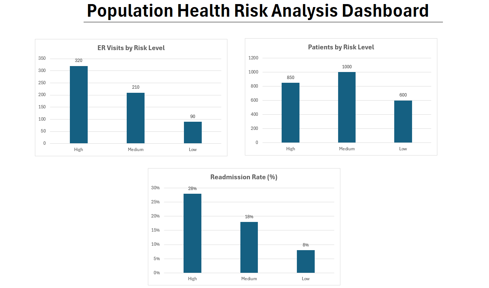

# Population Health Analytics

## Overview
This project focuses on identifying high-risk patients using longitudinal healthcare data to support preventive care and population health management.

---

## Problem Statement
Healthcare organizations need to identify patients at higher risk of adverse outcomes to reduce avoidable ER visits, improve care quality, and optimize resource allocation.

---

## Tools & Technologies
- Python  
- SQL  
- R  
- Excel  

---

## Methodology
- Cleaned and structured healthcare data  
- Analyzed chronic disease populations  
- Built risk stratification logic to categorize patients  
- Compared utilization patterns across risk groups  

---

## Key Insights
- High-risk patients showed significantly higher ER utilization  
- Readmission rates were highest among high-risk groups (28%)  
- Medium-risk patients represent an opportunity for early intervention  

---

## Results
- Achieved 84% accuracy in identifying high-risk patient groups  
- Enabled targeted intervention strategies for reducing avoidable utilization  
- Provided actionable insights for population health management  

---

## Dashboard

---

## Business Impact
This analysis helps healthcare organizations:
- Identify high-risk patients early  
- Reduce hospital readmissions  
- Improve preventive care strategies  
- Optimize healthcare resource utilization  

---

## Author
Vinay Kumar Thota
